# Conservative Logic[^1]

**Edward Fredkin and Tommaso Toffoli**

*MIT Laboratory for Computer Science, 545 Technology Square, Cambridge, Massachusetts 02139*

*International Journal of Theoretical Physics*, Vol. 21, Nos. 3/4, 1982, pp. 219–253  
Received May 6, 1981

*0020-7748/82/0400-0219$03.00/0 © 1982 Plenum Publishing Corporation*

## Abstract

Conservative logic is a comprehensive model of computation which explicitly reflects a number of fundamental principles of physics, such as the reversibility of the dynamical laws and the conservation of certain additive quantities (among which energy plays a distinguished role). Because it more closely mirrors physics than traditional models of computation, conservative logic is in a better position to provide indications concerning the realization of high-performance computing systems, i.e., of systems that make very efficient use of the "computing resources" actually offered by nature. In particular, conservative logic shows that it is ideally possible to build sequential circuits with zero internal power dissipation. After establishing a general framework, we discuss two specific models of computation. The first uses binary variables and is the conservative-logic counterpart of switching theory; this model proves that universal computing capabilities are compatible with the reversibility and conservation constraints. The second model, which is a refinement of the first, constitutes a substantial breakthrough in establishing a correspondence between computation and physics. In fact, this model is <mark>based on elastic collisions of identical "balls,"</mark> and thus is formally identical with the atomic model that underlies the (classical) kinetic theory of perfect gases. Quite literally, the functional behavior of a general-purpose digital computer can be reproduced by a perfect gas placed in a suitably shaped container and given appropriate initial conditions.

## 1. Introduction

This paper deals with conservative logic, a new mathematical model of computation which explicitly reflects in its axioms certain fundamental principles of physics. The line of approach offered by conservative logic avoids a number of dead ends that are found in traditional models and opens up fresh perspectives; in particular, it permits one to investigate within the model itself issues of efficiency and performance of computing processes.

Since many of the necessary technicalities have been thoroughly covered in a companion paper, "Reversible Computing" (Toffoli, 1981), here we shall have more freedom to present the ideas of conservative logic in a discursive fashion, stressing physical motivation and often making appeal to intuition.

Computation—whether by man or by machine—is a physical activity, and is ultimately governed by physical principles. An important role for mathematical theories of computation is to condense in their axioms, in a stylized way, certain facts about the ultimate physical realizability of computing processes. With this support, the user of the theory will be free to concentrate on the abstract modeling of complex computing processes without having to verify at every step the physical realizability of the model. Thus, for example, a circuit designer can systematically think in terms of Boolean logic (using, say, the AND, NOT, and FAN-OUT primitives) with the confidence that any network he designs in this way is immediately translatable into a working circuit requiring only well-understood, readily available components (the "gates," "inverters," and "buffers" of any suitable digital-logic family).

It is clear that for most routine applications one need not even be aware of the physical meaning of the axioms. However, in order to break new ground one of the first things to do is find out what aspects of physics are reflected in the axioms: perhaps one can represent in the axioms more realistic physics—and reveal hitherto unsuspected possibilities.

### 1.1. Physical Principles Already Contained in the Axioms

The Turing machine embodies in a heuristic form the axioms of computability theory. From Turing’s original discussion (Turing, 1936) it is clear that he intended to capture certain general physical constraints to which all concrete computing processes are subjected, as well as certain general physical mechanisms of which computing processes can undoubtedly avail themselves. At the core of Turing’s arguments, or, more generally, of Church’s thesis, are the following physical assumptions.

**P1.** *The speed of propagation of information is bounded.* (No “action at a distance”: causal effects propagate through local interactions.)

**P2.** *The amount of information which can be encoded in the state of a finite system is bounded.* (This is suggested by both thermodynamical and quantum-mechanical considerations; cf. Bekenstein (1981a) for a recent treatment.)

**P3.** *It is possible to construct macroscopic, dissipative physical devices which perform in a recognizable and reliable way the logical functions AND, NOT, and FAN-OUT.* (This is a statement of technological fact.)

### 1.2. Some Physical Principles That Haven’t Yet Found a Way into the Axioms

Assumptions P1 and P2 above set definite boundaries on the map of physically reachable computation schemes. On the other hand, Assumption P3 only represents an observed landmark, and should be taken as a starting point for an exploration rather than the end of the voyage.

It is well known that AND, NOT, and FAN-OUT constitute a universal set of logic primitives, and thus from a purely mathematical viewpoint there is no compelling reason to consider different primitives as a foundation for computation. However, the AND function is not invertible, and thus requires for its realization an irreversible device, i.e., a system that can reach the same final state from different initial states. In other words, in performing the AND operation one generally erases a certain amount of information about the system’s past.[^2] In contrast with the irreversibility of the AND function and of other common logical operations, the fundamental dynamical laws that underlie all physical phenomena are presumed to be strictly reversible. In physics, only macroscopic systems can display irreversible behavior. [Note that the term system has a different meaning for microscopic (or dynamical) systems and macroscopic (or statistical-mechanical) systems.]

> Physical laws come in two flavors, namely, dynamical and statistical laws. Dynamical laws apply to completely specified systems (in this context often called microscopic systems), and, at least in classical mechanics, they make predictions about individual experiments. To the best of the physicist’s knowledge, these laws are exactly reversible. Statistical laws apply to incompletely specified systems (which include what are in this context called macroscopic systems), and in general all they can say is something about the whole ensemble of systems that meet the given incomplete specifications, rather than about any individual system. In the case of macroscopic systems consisting of a very large number of interacting particles, certain statistical laws take the form of predictions concerning practically all (but not exactly all) individual experiments. These predictions can be organized into a consistent set of deterministic laws (the laws of thermodynamics), and it is only from the viewpoint of these quasi-laws that certain physical processes are irreversible [Katz, 1967].

On thermodynamical grounds, the erasure of one bit of information from the mechanical degrees of freedom of a system must be accompanied by the thermalization of an amount kT of energy (cf. Section 5). In today’s computers, for a host of practical reasons the actual energy dissipation is still from eight to twelve orders of magnitude larger (Herrell, 1974) than this theoretical minimum. However, technology is advancing fast, and the "kT" barrier looms as the single most significant obstacle to greater computer performance.

At this point, it is easy to see some shortcomings of the traditional approach to digital logic. Axioms for computation that are based on noninvertible primitives can only reflect aspects of macroscopic physics. While they offer enough expressive power for dealing in a formal way with what can eventually be computed by any physical means, they may deprive us of essential tools for discussing how best to compute—in particular, whether and how the kT barrier can be overcome—since many relevant aspects of microscopic physics are totally out of their reach. To remedy these deficiencies, the axioms of computation must be told some of the "facts of life" of the microscopic world. This is one of the goals of conservative logic.

One might object that perhaps physical computation is intrinsically irreversible, and thus necessarily an expression of macroscopic phenomena. Or, from another angle, how can axioms based on invertible primitives not miss some essential aspects of, say, recursive-function theory? Finally, even if the new "microscopic" axioms turned out after all to be both physically and mathematically adequate, wouldn’t they force one to construct much more complex structures in order to produce essentially the same results?

Attack is the best defense. We shall dispose of all of these objections not by indirect mathematical arguments or lengthy pleadings, but by counterexamples based on explicit constructions. These constructions will also show in a tangible way some of the advantages of our approach to computation.

<mark>The central result of conservative logic is that it is ideally possible to build sequential circuits with zero internal power dissipation.</mark> It will be clear from our discussion that we are not inadvertently toying with a scheme for a perpetual-motion machine.

Nondissipative computation demands that the mechanical degrees of freedom in which information is processed be effectively isolated from the thermal degrees of freedom (see Section 5). Today, this goal has been achieved only for a trivial Boolean function, namely, the identity function—for instance, in superconducting loops used as memory elements. To take a similar step for functions more complex than identity is not merely a problem of technical ingenuity; rather, as we recalled above and will discuss in more detail below, one faces serious conceptual difficulties, chiefly connected with the second principle of thermodynamics. These difficulties have been amply aired in the literature (Landauer, 1961). Theoretical as well as technical advances are needed to break the stalemate.

By showing how to reorganize computation at a logic level in a way that is compatible with fundamental physical principles, conservative logic provides the required theoretical breakthrough. In our opinion, this is also the beginning of a deeper and more meaningful dialogue between computer science and physics (cf. Landauer, 1967).

## 2. Conservative Logic: The Unit Wire and the Fredkin Gate

In this section we shall introduce, in the form of abstract primitives, the two computing elements on which conservative logic is based, namely, the unit wire and the Fredkin gate. An idealized physical realization of these elements will be discussed in Section 6.

The world of macroscopic physics offers an important advantage to systems designers. As long as one is willing to use large-scale effects, based on the collective action of very many particles, one can synthesize concrete computing devices corresponding to quite arbitrary abstract specifications. For instance, using suitably shaped "cams" and a sufficient amount of damping (which entails energy dissipation) one can generate a wide range of functions, including inverting amplifiers, adders, and threshold elements—and thus, for instance, NAND gates. However, the very macroscopic nature of these devices sets limits to their overall performance. It is true that electronic miniaturization has achieved great successes in reducing volume and power dissipation and increasing circuit speed. Yet, it is well known that attempts to improve performance by carrying miniaturization to an extreme eventually lead to problems of noise and unreliability. Devices based on the "average" behavior of many particles become quite useless for the intended purpose when the number of particles is so small that statistical fluctuations become significant.

By contrast, in the world of microscopic physics interactions are dissipationless; also, predictable interactions can take place in a much shorter space and time, since the accuracy of the interaction laws does not depend on averages taken over many particles. Thus, microphysics appears to have many attractions for the efficiency-minded designer. However, there one can choose only from a limited catalog of functions, namely, those realized by microscopic physical effects.

In this context, it would be pointless to insist on using abstract computing primitives chosen merely on grounds of mathematical convenience, only to discover that they cannot be realized by any of the available physical functions. Rather, the selection of primitives must be guided at first by criteria of physical plausibility. Later on, when a certain set of primitives chosen according to these criteria will have been found satisfactory in terms of computing capabilities, one should attempt to verify their actual physical implementability. This is indeed the plan that we shall follow in our exposition of conservative logic.

### 2.1. Essential Primitives for Computation

Computation is based on the *storage*, *transmission*, and *processing* of discrete signals. Therefore, any choice of primitives will have to include suitable building blocks for these computing activities.

### 2.2. Fundamental Constraints of a Physical Nature

We have the following assumptions.

**P4.** *Identity of transmission and storage.* As we shall explain in more detail below, from a relativistic viewpoint there is no intrinsic distinction between storage and transmission of signals. Therefore, we shall seek a single storage-transmission primitive capable of indifferently supporting either function.

**P5.** *Reversibility.* At a microscopic, deterministic level, dynamical laws are reversible, i.e., distinct initial states always lead to distinct final states (this is true in both the classical and the quantum mechanical formulations of these laws). Therefore, we shall seek abstract primitives in the form of *invertible functions*.[^3]

**P6.** *One-to-one composition.* The concept of “function composition” is a fundamental one in the theory of computing. According to the ordinary rules for function composition, an output variable of one function may be substituted for any number of input variables of other functions, i.e., arbitrary “fan-out” of lines is allowed. However, the process of generating multiple copies of a given signal is far from trivial from a physical viewpoint, and must be treated with particular care when reversibility is an issue. In fact, this process involves the interaction of an “intelligence” signal with a predictable source of energy (a “power supply”) in a suitable device such as an amplifier. <mark>For this reason, we shall require that any fan-out of signals take place within explicit signal-processing elements, and we shall restrict the meaning of the term *function composition* to *one-to-one composition*, i.e., composition with one-to-one substitution of output variables for input variables.</mark> From an abstract viewpoint, the responsibility for providing fan-out is shifted from the composition rules to the computing primitives.

**P7.** *Conservation of additive quantities.* It is easy to prove (Landau and Lifshitz, 1961) that in all reversible systems there exist a number of independent conserved quantities, i.e., functions of the system’s state that are constant on any trajectory or orbit. In general, of most of these functions little is known besides their existence, since they are exceedingly ill-behaved (typically, they are not analytic). However, in many physical systems the dynamical laws possess certain symmetries, and in correspondence with these symmetries one can identify a number of conserved quantities that are much better behaved; namely, they are analytic and, which is more important, additive (that is, these quantities are defined for individual portions of a system, and contributions from different portions add up). Additive conserved quantities play a vital role in theoretical physics.

Of the above-mentioned symmetries, some derive from the uniformity of space-time, and express themselves through conservation principles such as the conservation of energy (homogeneity of time), momentum (homogeneity of space), and angular momentum (isotropy of space). Other symmetries which do not have a classical counterpart can be found in the quantum dynamics of elementary particles. Since we are interested in physical computation rather than physics per se, we shall not try to explicitly account for all the symmetries of microscopical dynamics—and thus for all of its conservation rules. Rather, we shall require that our abstract model of computation possess at least one additive conserved quantity, to be thought of as a prototype of the many such quantities of physics.

**P8.** *The topology of space-time is locally Euclidean.* Intuitively, the amount of “room” available as one moves away from a certain point in space increases as a power (rather than as an exponential) of the distance from that point,18 thus severely limiting the connectivity of a circuit.23 While we shall not explicitly deal with this constraint in presenting conservative logic here, our overall approach and in particular the billiard-ball model of computation (Section 6) will be consistent with it.

### 2.3. The Unit Wire

Let us consider a signal connecting two space-time events \(P_0\) and \(P_1\). If in a given reference frame the events \(P_0, P_1\) are spatially separated, then one says that the signal was *transmitted* from \(P_0\) to \(P_1\). On the other hand, if in the given frame \(P_0\) and \(P_1\) take place at the same point in space, one says that the signal was *stored* at that point. [For example, I can send a message to my secretary over the phone (transmission), or I can leave a note on my desk for him or her to find in the morning (storage). Note that in the second case the “stored” message may have traveled a million miles from the viewpoint of an observer at rest with the solar system as a whole.] Thus, it is clear that the terms “storage” and “transmission” describe from the viewpoint of different reference frames one and the same physical process.

In conservative logic, these two functions are performed by a single storage-transmission primitive called the unit wire, whose intuitive role is to move one bit of information from one point of space-time to another separated by one unit of time. The unit wire is defined by the table

| \(x^t\) | \(y^{t+1}\) |
|---:|---:|
| 0 | 0 |
| 1 | 1 |

**(1)**

(where the superscript denotes the abstract "time" in which events take place in a discrete dynamical system), and is graphically represented as in Figure 1. The value that is present at a wire’s input at time t (and at its output at time t + 1) is called the state of the wire at time t.

From the unit wire one obtains by composition more general wires of arbitrary length. Thus, a wire of length \(i\) (\(i \ge 1\)) represents a space-time signal path whose ends are separated by an interval of \(i\) time units. For the moment we shall not concern ourselves with the specific spatial layout of such a path (cf. constraint P8).

Observe that the unit wire is invertible, conservative (i.e., it conserves in the output the number of 0’s and 1’s that are present at the input), and is mapped into its inverse by the transformation \(t \mapsto -t\).

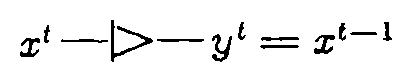

*Figure 1. The unit wire.*

### 2.4. Conservative-Logic Gates; The Fredkin Gate

Having introduced a primitive whose role is to represent signals, we now need primitives to represent in a stylized way physical computing events.

A conservative-logic gate is any Boolean function that is invertible and conservative (cf. Assumptions P5 and P7 above). It is well known that, under the ordinary rules of function composition (where fan-out is allowed), the two-input NAND gate constitutes a universal primitive for the set of all Boolean functions. In conservative logic, an analogous role is played by a single signal-processing primitive, namely, the Fredkin gate, defined by the table

| \(u\) | \(x_1\) | \(x_2\) | \(v\) | \(y_1\) | \(y_2\) |
|---:|---:|---:|---:|---:|---:|
| 0 | 0 | 0 | 0 | 0 | 0 |
| 0 | 0 | 1 | 0 | 1 | 0 |
| 0 | 1 | 0 | 0 | 0 | 1 |
| 0 | 1 | 1 | 0 | 1 | 1 |
| 1 | 0 | 0 | 1 | 0 | 0 |
| 1 | 0 | 1 | 1 | 0 | 1 |
| 1 | 1 | 0 | 1 | 1 | 0 |
| 1 | 1 | 1 | 1 | 1 | 1 |

**(2)**

and graphically represented as in Figure 2a. This computing element can be visualized as a device that performs conditional crossover of two data signals according to the value of a control signal (Figure 2b). When this value is 1 the two data signals follow parallel paths; when 0, they cross over. Observe that the Fredkin gate is nonlinear and coincides with its own inverse.

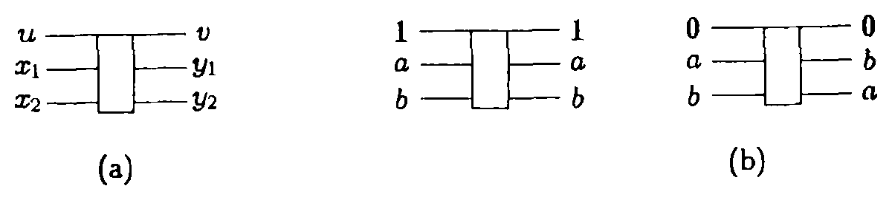

*Figure 2. (a) Symbol and (b) operation of the Fredkin gate.*

In conservative logic, all signal processing is ultimately reduced to conditional routing of signals. Roughly speaking, signals are treated as unalterable objects that can be moved around in the course of a computation but never created or destroyed. For the physical significance of this approach, see Section 6.

### 2.5. Conservative-Logic Circuits

Finally, we shall introduce a scheme for connecting signals, represented by unit wires, with events, represented by conservative-logic gates.

A conservative-logic circuit is a directed graph whose nodes are conservative-logic gates and whose arcs are wires of any length (cf. Figure 3).

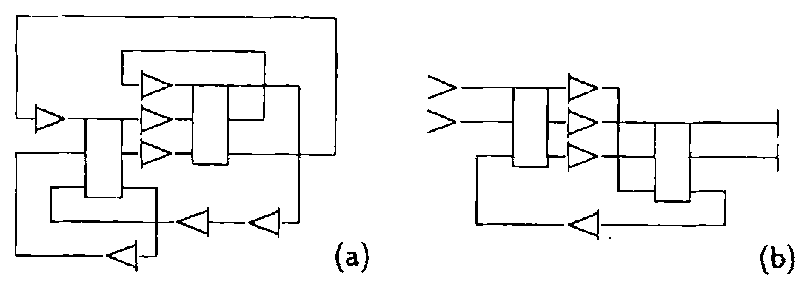

*Figure 3. (a) Closed and (b) open conservative-logic circuits.*

Any output of a gate can be connected only to the input of a wire, and similarly any input of a gate only to the output of a wire. The interpretation of such a circuit in terms of conventional sequential computation is immediate, as the gate plays the role of an "instantaneous" combinational element and the wire that of a delay element embedded in an interconnection line. In a closed conservative-logic circuit, all inputs and outputs of any elements are connected within the circuit (Figure 3a). Such a circuit corresponds to what in physics is called a closed (or isolated) system. An open conservative-logic circuit possesses a number of external input and output ports (Figure 3b). In isolation, such a circuit might be thought of as a transducer (typically, with memory) which, depending on its initial state, will respond with a particular output sequence to any particular input sequence. However, usually such a circuit will be thought of as a portion of a larger circuit; thence the notation for input and output ports (Figure 3b), which is suggestive of, respectively, the trailing and the leading edge of a wire. Observe that in conservative-logic circuits the number of output ports always equals that of input ones.

The junction between two adjacent unit wires can be formally treated as a node consisting of a trivial conservative-logic gate, namely, the identity gate. In what follows, whenever we speak of the realizability of a function in terms of a certain set of conservative-logic primitives, the unit wire and the identity gate will be tacitly assumed to be included in this set.

A conservative-logic circuit is a time-discrete dynamical system. The unit wires represent the system’s individual state variables, while the gates (including, of course, any occurrence of the identity gate) collectively represent the system’s transition function. The number \(N\) of unit wires that are present in the circuit may be thought of as the number of degrees of freedom of the system. Of these \(N\) wires, at any moment \(N_1\) will be in state 1, and the remaining \(N_0=N-N_1\) will be in state 0. The quantity \(N_1\) is an additive function of the system’s state, i.e., is defined for any portion of the circuit and its value for the whole circuit is the sum of the individual contributions from all portions. Moreover, since both the unit wire and the gates return at their outputs as many 1’s as are present at their inputs, the quantity \(N_1\) is an integral of the motion of the system, i.e., is constant along any trajectory. (Analogous considerations apply to the quantity \(N_0\), but, of course, \(N_0\) and \(N_1\) are not independent integrals of the motion.) It is from this “conservation principle” for the quantities in which signals are encoded that conservative logic derives its name.

It must be noted that reversibility (in the sense of mathematical invertibility) and conservation are independent properties, that is, there exist computing circuits that are reversible but not "bit-conserving," (Toffoli, 1980) and vice versa (Kinoshita, 1976).

## 3. Computation in Conservative-Logic Circuits; Constants and Garbage

In Figure 4a we have expressed the output variables of the Fredkin gate as explicit functions of the input variables. The overall functional relationship between input and output is, as we have seen, invertible. On the other hand, the functions that one is interested in computing are often noninvertible. Thus, special provisions must be made in the use of the Fredkin gate (or, for that matter, of any invertible function that is meant to be a general-purpose signal-processing primitive) in order to obtain adequate computing power.

Suppose, for instance, that one desires to compute the AND function, which is not invertible. In Figure 4b only inputs \(u\) and \(x_1\) are fed with arbitrary values \(a\) and \(b\), while \(x_2\) is fed with the constant value 0. In this case, the \(y_1\) output will provide the desired value \(ab\) (“\(a\) AND \(b\)”), while the other two outputs \(v\) and \(y_2\) will yield the “unrequested” values \(a\) and \(\bar a b\). Thus, intuitively, the AND function can be realized by means of the Fredkin gate as long as one is willing to supply “constants” to this gate alongside the argument, and accept “garbage” from it alongside the result. This situation is so common in computation with invertible primitives that it will be convenient to introduce some terminology in order to deal with it in a precise way.

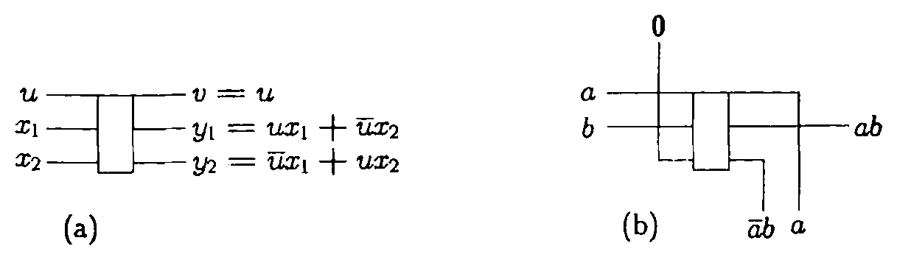

*Figure 4. Behavior of the Fredkin gate (a) with unconstrained inputs, and (b) with \(x_2\) constrained to the value 0, thus realizing the AND function.*

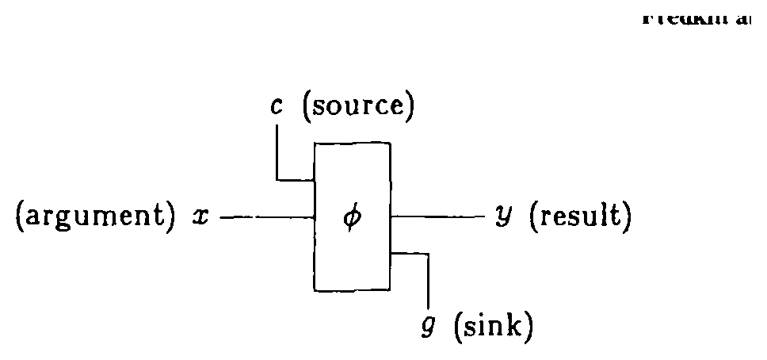

*Figure 5. Realization of \(f\) by \(\phi\) using source and sink. The function \(\phi:(c,x)\mapsto(y,g)\) is chosen so that, for a particular value of \(c\), \(y=f(x)\).*

***Terminology: source, sink, constants, garbage.*** Given any finite function \(\phi\), one obtains a new function \(f\) “embedded” in it by assigning specified values to certain distinguished input lines (collectively called the *source*) and disregarding certain distinguished output lines (collectively called the *sink*). The remaining input lines will constitute the *argument*, and the remaining output lines, the *result*. This construction (Figure 5) is called a realization of \(f\) by means of \(\phi\) using source and sink. In realizing \(f\) by means of \(\phi\), the source lines will be fed with constant values, i.e., with values that do not depend on the argument. On the other hand, the sink lines in general will yield values that depend on the argument, and thus cannot be used as input constants for a new computation. Such values will be termed *garbage*. (Much as in ordinary life, this garbage is not utterly worthless material. In Section 7, we shall show that thorough “recycling” of garbage is not only possible, but also essential for achieving certain important goals.)

By a proper selection of source and sink lines and choice of constants, it is possible to obtain from the Fredkin gate other elementary Boolean functions, such as OR, NOT, and FAN-OUT (Figure 6). In order to synthesize more complex functions one needs circuits containing several occurrences of the Fredkin gate. For example, Figure 7 illustrates a 1-line-to-4-line demultiplexer. Because of the delays represented by the wires, this is formally a sequential network. However, since no feedback is present and all paths from the argument to the result traverse the same number of unit wires, the analysis of this circuit is substantially identical to that of a combinational network.[^4]

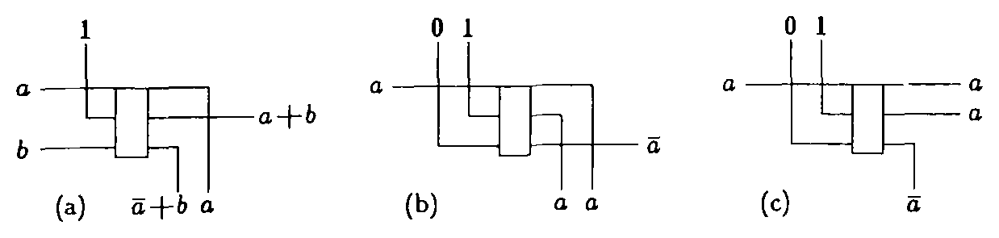

*Figure 6. Realization of the (a) OR, (b) NOT, and (c) FAN-OUT functions by means of the Fredkin gate.*

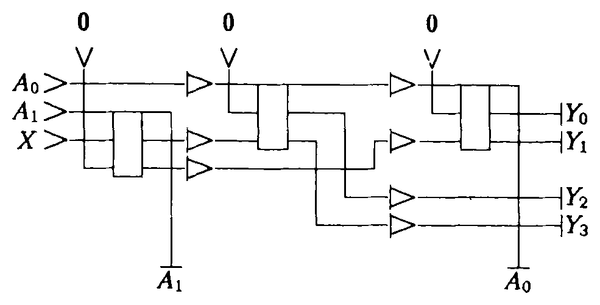

*Figure 7. 1-line-to-4-line demultiplexer. The “address” lines \(A_0, A_1\) specify to which of the four outputs \(Y_0,\ldots,Y_3\) the “data” signal \(X\) is to be routed. (Here the sink lines happen to echo the address lines.)*

Finally, Figure 8 shows a conservative-logic realization of the \(J-\overline K\) flip-flop. (In a figure, when the explicit value of a sink output is irrelevant to the discussion we shall generically represent this value by a question mark.) Unlike the previous circuit, where the wires act as “transmission” lines, this is a sequential network with feedback, and the wire plays an effective role as a “storage” element.

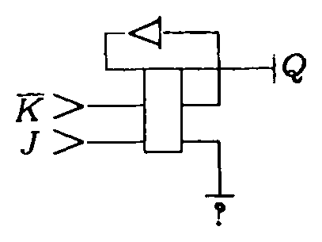

*Figure 8. Realization of the \(J-\overline K\) flip-flop.*

## 4. Computation Universality of Conservative Logic

An important result of conservative logic is that it is possible to preserve the computing capabilities of ordinary digital logic while satisfying the "physical" constraints of reversibility and conservation.

Let us consider an arbitrary sequential network constructed out of conventional logic elements, such as AND and OR gates, inverters (or "NOT" gates), FAN-OUT nodes, and delay elements. For definiteness, we shall use as an example the network of Figure 9—a serial adder (mod 2). By replacing in a one-to-one fashion these elements (with the exception of the delay element—cf. footnote at the end of Section 3) with a conservative-logic realization of the same elements (as given, for example, in Figures 4b, 6a, 6b, and 6c), one obtains a conservative-logic network that performs the same computation (Figure 10). Such a realization may involve a nominal slow-down factor, since a path that in the original network contained only one delay element may now traverse several unit wires. (For instance, the realization of Figure 9 has a slow-down factor of 5; note, however, that only every fifth time slot is actually used for the given computation, and the remaining four time slots are available for other independent computations, in a time-multiplexed mode.) Moreover, a number of constant inputs must be provided besides the argument, and the network will yield a number of garbage outputs besides the result.

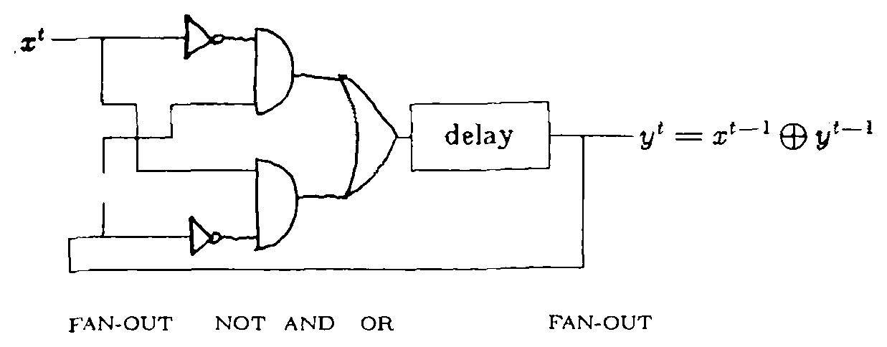

*Figure 9. An ordinary sequential network computing the sum (mod 2) of a stream of binary digits. Recall that \(a\oplus b=a\bar b+\bar a b\).*

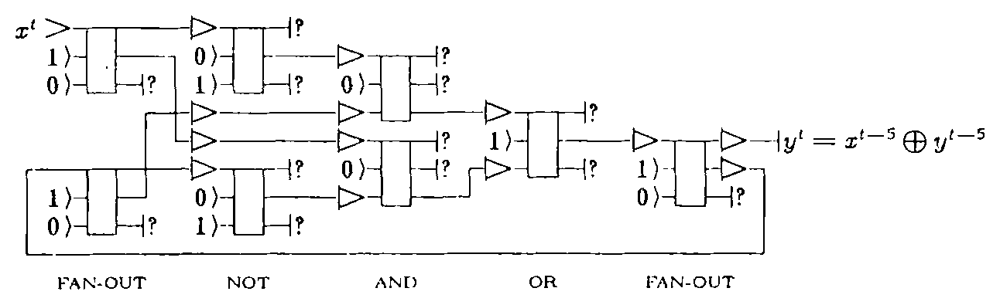

*Figure 10. A conservative-logic realization of the network of Figure 9.*

The above construction is given as a general existence proof of conservative-logic networks having the desired computing capabilities, and makes no claims of yielding networks that are optimized in terms of number of gates, delay stages, or source and sink lines. Of course, by designing directly in conservative logic—rather than simulating a conventional sequential network—one usually obtains circuits that perform the same computation in a much simpler way (cf. Figure 11).

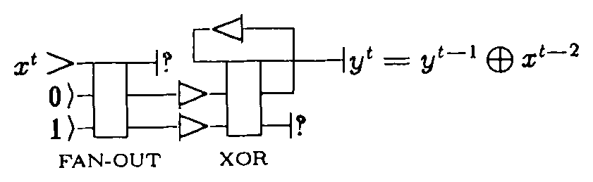

*Figure 11. A simpler conservative-logic realization of the serial adder (mod 2).*

In conclusion, any computation that can be carried out by a conventional sequential network can also be carried out by a suitable conservative-logic network, provided that an external supply of constants and an external drain for garbage are available. In Section 7, we shall show that even these requirements can be made essentially to vanish.

The theory of computability is based on paradigms that are more general than finite sequential networks—namely, Turing machines and cellular automata, which are systems of indefinitely extendible size. In analogy with the above construction, it can be shown that there exist both universal Turing machines (Bennett, 1973) and computation- and construction-universal cellular automata (Toffoli, 1977) based on conservative logic. (To be precise, Bennett’s and Toffoli’s arguments only deal with the reversibility constraint; however, once this one is satisfied, the conservation constraint can easily be introduced without modifying the conclusions.) Historically, Bennett’s construction had a very important role in opening up the present field of investigation. Let us explicitly note that in both Turing machines and cellular automata the usual initialization conditions (respectively, blank tape and quiescent environment) provide an infinite supply of constants from within the system, and similarly infinite room for the "disposal" of garbage, so that in these systems the constraints of conservative logic can be met without introducing external source and sink lines, and thus in full agreement with the standard definitions of these systems.

## 5. Nondissipative Computation

The questions one asks of a theory depend to a great extent on its intended applications. Since one of our main concerns is more efficient physical computation, we shall suspend for a moment the mathematical development of conservative logic in order to discuss its physical interpretation. In particular, we shall discuss certain connections between computation, information theory, and thermodynamics.

An isolated physical system consisting of a substantial amount (say, 1 g) of matter possesses an enormous number of degrees of freedom, or modes, of the order of magnitude of Avogadro’s number (\(\sim 10^{23}\)). In general, the initial conditions and the mutual interactions between such a large number of modes cannot be given or analyzed in any detail. However, in a suitably prepared system having a great degree of regularity there are a few distinguished modes (the so-called *mechanical modes*—inclusive of electric, magnetic, chemical, etc. degrees of freedom) for which one can separate exact or approximate equations of motion independently of all the other modes (the large pool of *thermal modes*). These equations describe an experimentally accessible functional relationship between the system’s initial and final conditions, and in this sense the system can be seen as a mechanical computer.

*Conservative mechanisms.* One case in which one can achieve this separation in the description of a system is when the mechanical modes interact much more strongly between themselves than with the thermal modes—for example, a spinning top in a gravitational field. In the ideal case, where the coupling between mechanical and thermal modes vanishes, the mechanical modes will constitute a perfectly isolated—and, of course, reversible—subsystem. Note that in this case, while the mean energy of the thermal modes is of the order of \(kT\) (where \(k\) is Boltzmann’s constant and \(T\) the temperature of the system), there will be no *a priori* connection between this energy and that of any of the mechanical modes, which is in principle arbitrary. (Of course, one may have to reckon with \(kT\) at the moment of initializing the mechanical modes, since this process entails some form of coupling with the rest of the world.)

*Damped mechanisms.*[^5] There is another way in which one can achieve separate equations of motion for the mechanical modes; unlike the previous case, this way only works for special initial conditions. Suppose that the subsystem comprising the mechanical modes were required to be *irreversible*. As such, this subsystem cannot exist in isolation, but must be coupled to the thermal modes. Intuitively, since the information that is lost by the mechanical modes in their irreversible evolution cannot just “disappear” (at the bottom level physics is strictly reversible), one must open a door, as it were, between mechanical and thermal modes, so that the information lost by the mechanical modes will be transferred to the thermal ones; this process is called *damping*. But, again, at physics’ bottom level there are no one-way doors, and in general unwanted information or *noise* will flow through the door from the thermal modes to the mechanical ones, rendering the mechanical subsystem nondeterministic. In Feynman’s words, “If we know where the *damping comes from*, it turns out that that is also the source of the *fluctuations*” (Feynman, 1963). A way out of this dilemma is to encode information in the mechanical subsystem in an extremely redundant way, so that the nondeterministic component of its behavior can be easily filtered out. Typically, each mechanical mode is coupled to very many thermal modes, and is given an initial energy \(E\) much greater than that of any single one of them, i.e., \(E \gg kT\). With such asymmetrical initial conditions, energy will flow preferentially from the mechanical modes to the thermal ones, and will somehow manage to carry information with it. (Even though this empirical approach does indeed work, we must admit that the connection between energy and information exchanges in physical systems is still poorly understood.) Of course, for sustained operation of a damped system it is necessary to regularly replenish the mechanical modes with free energy and flush heat out of the thermal modes; this process is called *signal regeneration*.

Today, digital computers invariably follow this second approach, i.e., are based on damped processes. The main reason is that from a technological viewpoint it is much easier to “tame” friction—so that it will work in a controlled and predictable way—than to eliminate it altogether. Moreover, any small deviations of a mechanism from its nominal specifications usually result in noise that is in first approximation indistinguishable from thermal noise (Keyes, 1977; Haken, 1975) (in other words, imperfect knowledge of the dynamical laws leads to uncertainties in the behavior of a system comparable to those arising from imperfect knowledge of its initial conditions). Thus, the same regenerative processes which help overcome thermal noise also permit reliable operation in spite of substantial fabrication tolerances.

In this situation, where widespread irreversible processes have already been designed into a computer for essentially technological reasons, it is very easy to accommodate any additional irreversibility arising from the very nature of the logic primitives (such as the AND function) which one tries to realize. Actually, the two relevant processes, namely, interaction of signals (i.e., computing proper) and signal damping and regeneration, are usually found associated in such an intimate way within the same physical device (say, a transistor) that they cannot be separated and dealt with independently. As a consequence, today’s algorithms and circuits are geared to specifying a computation in terms of a sequence of "off-the-shelf” noninvertible steps (such as AND, CLEAR REGISTER, etc.) even when the overall function to be computed is invertible or nearly so.

The great tolerance that damped mechanisms have for imprecision and noise at the design, fabrication, and operation stage should not make one forget their intrinsic inefficiency. In many practical situations this inefficiency is felt only in terms of energy consumption. With computers, however, one is not so much concerned with the "electric bill," i.e., with the cost of free energy, as with heat disposal. For brevity, we shall discuss only one limiting factor. Since signals cannot travel faster than light, higher throughput in a computer can eventually be achieved only by closer packing of circuit elements. In a damped circuit, the rate of heat generation is proportional to the number of computing elements, and thus approximately to the useful volume; on the other hand, the rate of heat removal is only proportional to the free surface of the circuit. As a consequence, computing circuits using damped mechanisms can grow arbitrarily large in two dimensions only, thus precluding the much tighter packing that would be possible in three dimensions.

For this and other reasons (cf. Section 2), there is strong appeal in the idea of computers based on conservative mechanisms. Yet, common sense based on experience tends to make one uneasy with this concept. So many theoretical and practical difficulties immediately come to mind that it is not easy to think of this concept as one that might after all be viable. We shall pose straightaway four fundamental questions.

**Question 1.** Are there reversible systems capable of general-purpose computation?

**Question 2.** Are there any specific physical effects (rather than mere mathematical constructs) on which reversible computation can in principle be based?

**Question 3.** In Section 4, we have achieved reversibility of computation at the cost of keeping garbage signals within the system’s mechanical modes. In a complex computation, won’t garbage become unmanageable if we cannot dissipate it? And won’t the need to dissipate garbage write off any energy savings that one may have achieved by organizing the computation in a reversible way?

**Question 4.** Finally, without damping and signal regeneration, won’t the slightest residual noise either in the initial conditions or in the running environment be amplified by an enormous factor during a computation, and render the results meaningless?

The answer to Question 1 is an unequivocal "yes," as we have seen in Section 4.

In the next section, we make an important step toward a positive answer to Question 2, by introducing a model of computation based on elastic collisions of hard balls. This model is, of course, still quite stylized from a physical point of view. However, such collisions constitute a prototype for more realistic physical phenomena, such as inverse-square-law (e.g., electromagnetic) interactions.

Section 7 gives a substantial contribution toward a positive answer to Question 3 (a complete answer cannot be given without solving first Question 4). In fact, we show that the number of data lines involved in the constants-to-garbage conversion need only be proportional, in the worst case, to the number of argument-result lines, rather than proportional to the number of gates (note that in the generic combinational circuit the number of gates increases exponentially with the number of argument lines). This requires only a small increase in circuit complexity with respect to conventional circuits.

In this paper, we shall not attempt to answer Question 4, which is connected with many unresolved theoretical and experimental issues. However, we shall note that there are known today practically realizable physical contexts—such as superconducting systems—in which total decoupling between mechanical modes and thermal ones is effectively achieved.

## 6. A “Billiard Ball” Model of Computation

In this section we shall introduce a model of computation (the billiard ball model) based on stylized but quite recognizable physical effects, namely, elastic collisions involving balls and fixed reflectors. The "rules of the game" for this model are identical to those that underlie the classical kinetic theory of perfect gases—where the balls are interpreted as gas molecules and the reflectors as sections of the container’s walls. Intuitively, we show that by giving the container a suitable shape (which corresponds to the computer’s hardware), and the balls suitable initial conditions (which correspond to the software—program and input data), one can carry out any specified computation.

It is obvious that any configuration of physical bodies evolving according to specified interaction laws can be interpreted as performing some sort of computation (it certainly computes its own future state). In general, though, determining how—if at all—a desired computation can be set up starting from assigned interaction laws is an awful computational task. On the other hand, the systems in which we routinely design computations (time- and state-discrete "dynamical systems" based on Boolean variables and Boolean functions) are very abstract objects and in general bear little resemblance to physical systems. Conservative-logic circuits are Boolean dynamical systems; yet, they were made to satisfy constraints P4, P5, and P6 (i.e., identity of transmission and storage, reversibility, and one-to-one composition; cf. Section 2) on the assumption that this would lead to a closer correspondence with physics and, ultimately, to a natural physical realization of such circuits. Indeed, the results of the present section offer strong support for this assumption. Briefly, one can establish a direct correspondence between the primitives and composition rules of conservative logic and certain elementary features of the billiard ball model, to the point that any conservative-logic circuit can be read as the full "schematics" of a billiard ball computer. From then on,[^6] the design of a nondissipative physical computer is reduced to the design of a suitable conservative-logic network.

### 6.1. Basic Elements of the Billiard Ball Model

Let us consider a two-dimensional grid as in Figure 12a (we shall take as the unit of distance the spacing between neighboring grid points) and identical hard balls of radius \(1/\sqrt{2}\) traveling along the grid’s principal directions at the velocity of one unit of space per unit time interval. At time \(t=0\) the center of each ball lies on a grid point, and thus will again coincide with a grid point at all integral values of time (\(t=1,2,3,\ldots\)), and only at such moments. Because of the choice \(r=1/\sqrt{2}\), the above kinematic features are preserved after right-angle elastic collisions between balls (cf. Figure 12b). In what follows, we shall restrict our attention to collisions of this kind. Observe that in Figure 12b the left-to-right component of a ball’s velocity is not affected by the collision. Thus, straightforward graphic construction methods are sufficient to guarantee the appropriate synchronization of complex collision patterns such as those of Figure 18, since balls that are vertically aligned at time \(t=0\) will maintain their vertical alignment throughout the whole process.

It is clear that the presence or the absence of a ball at a given point of the grid can be interpreted as a binary variable, taking on a value of 1 or 0 (for "ball" and "no ball," respectively) at each integral value of time. The correlations between such variables reflect the movements of the balls themselves. In particular, one may speak of binary "signals" traveling on the grid and interacting with one another.

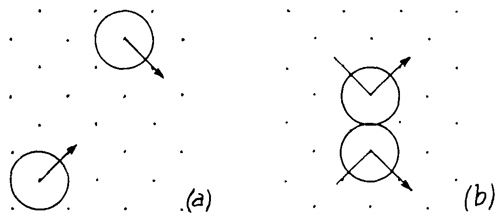

*Figure 12. (a) Balls of radius \(1/\sqrt{2}\), traveling on a unit grid. (b) Right-angle elastic collision between two balls.*

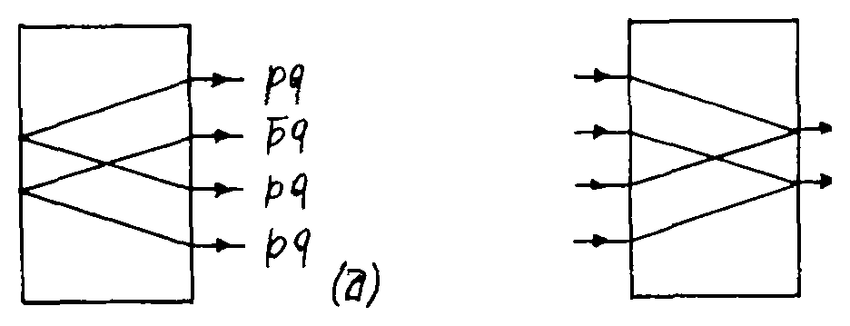

*Figure 13. (a) The interaction gate and (b) its inverse.*

### 6.2. The Interaction Gate

The *interaction gate* is the conservative-logic primitive defined by Figure 13a, which also assigns its graphical representation.[^7]

In the billiard ball model, the interaction gate is realized simply as the potential locus of collision of two balls. With reference to Figure 14, let \(p,q\) be the values at a certain instant of the binary variables associated with the two points \(P,Q\), and consider the values—four time steps later in this particular example—of the variables associated with the four points \(A,B,C,D\). It is clear that these values are, in the order shown in the figure, \(pq\), \(\bar p q\), \(p\bar q\), and \(pq\). In other words, there will be a ball at \(A\) if and only if there was a ball at \(P\) and one at \(Q\); similarly, there will be a ball at \(B\) if and only if there was a ball at \(Q\) and none at \(P\); etc.

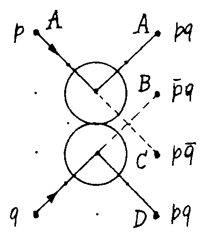

*Figure 14. Billiard ball model realization of the interaction gate.*

### 6.3. Interconnection; Timing and Crossover; The Mirror

Owing to its AND and NOT capabilities, the interaction gate is clearly a universal logic primitive (as explained in Section 5, we assume the availability of input constants). To verify that these capabilities are retained in the billiard ball model, one must make sure that one can realize the appropriate interconnections, i.e., that one can suitably route balls from one collision locus to another and maintain proper timing. In particular, since we are considering a planar grid, one must provide a way of performing signal crossover.

All of the above requirements are met by introducing, in addition to collisions between two balls, collisions between a ball and a fixed plane mirror. In this way, one can easily deflect the trajectory of a ball (Figure 15a), shift it sideways (Figure 15b), introduce a delay of an arbitrary number of time steps (Figure 15c), and guarantee correct signal crossover (Figure 15d). Of course, no special precautions need be taken for trivial crossover, where the logic or the timing are such that two balls cannot possibly be present at the same moment at the crossover point (cf. Figure 18 or 12a). Thus, in the billiard ball model a conservative-logic wire is realized as a potential ball path, as determined by the mirrors.

Note that, since balls have finite diameter, both gates and wires require a certain clearance in order to function properly. As a consequence, the metric of the space in which the circuit is embedded (here, we are considering the Euclidean plane) is reflected in certain circuit-layout constraints (cf. P8, Section 2). Essentially, with polynomial packing (corresponding to the Abelian-group connectivity of Euclidean space) some wires may have to be made longer than with exponential packing (corresponding to an abstract space with free-group connectivity) (Toffoli, 1977).

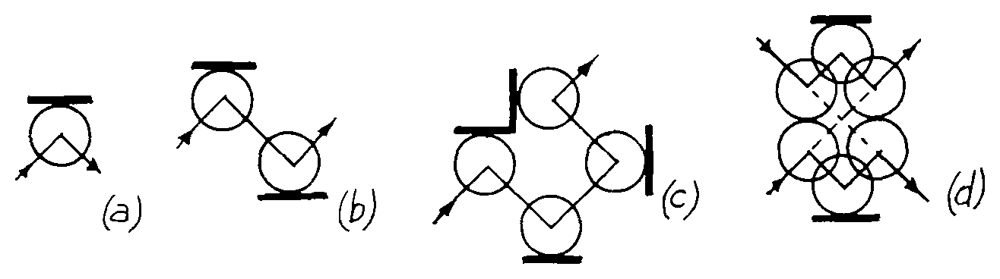

*Figure 15. The mirror (indicated by a solid dash) can be used to deflect a ball’s path (a), introduce a sideways shift (b), introduce a delay (c), and realize nontrivial crossover (d).*

### 6.4. The Switch Gate and the Fredkin Gate

In designing conservative-logic circuits in the billiard ball model, it is convenient to have available a wider set of primitives. Such primitives can be constructed “from scratch,” utilizing various collision patterns, or can be synthesized starting from the interaction gate as a building block. Different trade-offs can be achieved between total delay, number of collisions, number of nontrivial crossovers, etc.

For example, the switch gate (cf. Priese, 1976), defined in Figure 16, realizes the conditional routing of one data signal by one control signal, and is a more convenient primitive in certain design situations.

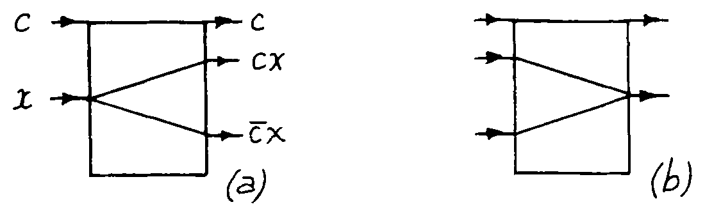

*Figure 16. The switch gate and its inverse. Input signal \(x\) is routed to one of two output paths depending on the value of the control signal, \(c\).*

Figure 17 shows a billiard ball realization of this gate, as suggested by A. Ressler.

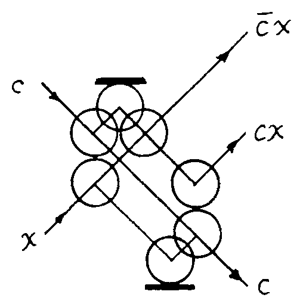

*Figure 17. A simple realization of the switch gate.*

Finally, Figure 18 illustrates two billiard ball realizations of the Fredkin gate, one (due to R. Feynman and A. Ressler) based on the switch gate, and one (in a version by N. Margolus) based directly on the interaction gate.

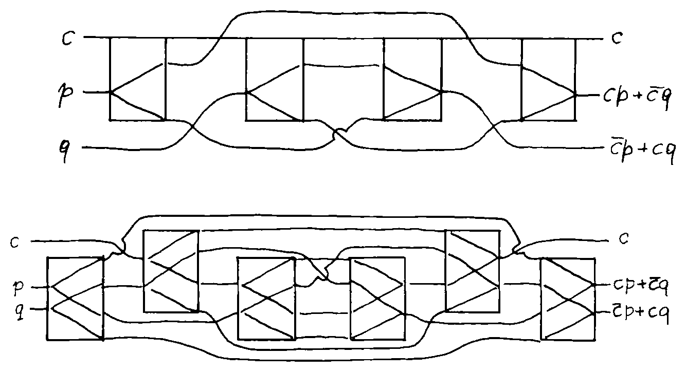

*Figure 18. Two realizations of the Fredkin gate. Steering and timing mirrors are not explicitly indicated. The “bridge” symbol denotes nontrivial crossover; all other crossovers are of the trivial kind. The unit wires are not indicated.*

We have thus shown that the primitives and the composition rules of conservative logic have a straightforward realization in the billiard ball model of computation. In the remainder of this paper, we shall use the tools of conservative logic to deal with important issues of feasibility and of complexity of computational schemes. The fact that conservative logic can be put into correspondence with an underlying physical model such as the billiard ball model of computation will provide a tangible motivation for many of these questions, and will suggest a physical interpretation of our results.

In the past century, a satisfactory explanation for the macroscopic behavior of perfect gases was arrived at by applying statistical mechanical arguments to kinematic models of a gas. The simplest such model represents molecules as spheres of finite diameter. Both molecules and container walls are perfectly hard and elastic, and collisions are instantaneous.

Billiard ball computation is based on the same idealized physical primitives. However, here we are in a better position to deal with individual systems (rather than statistical mechanical ensembles) because of enormous computational advantages. In fact, the balls (which correspond to gas molecules) are given very special initial conditions, while the collection of mirrors (which correspond to the container’s walls) is given a very special shape. Owing to these "very special" features, any trajectory can be explicitly computed for an arbitrary length very efficiently (each collision requires a simple Boolean operation rather than the numerical integration of a differential equation) and exactly (there is no loss of resolution due to truncation or round-off errors). Thus, it is possible to reconstruct on an exact, quantitative basis a number of thermodynamical arguments or gedanken experiments which are traditionally couched in a qualitative way and are not always clear or convincing.

## 7. Garbageless Conservative-Logic Circuits

In Section 4, we showed that universal computing capabilities can be achieved in a reversible mechanism with the proviso that one may have to supply input constants alongside the argument and may obtain garbage signals alongside the result. In this section, we shall consider whether such conversion of constants into garbage must always accompany nontrivial reversible computation, and to what extent.

In physical computation, where signals are encoded in some form of energy, the reversibility of a mechanism guarantees only that no energy is dissipated within the mechanism itself, i.e., that no energy is transferred from the degrees of freedom in which signals are encoded (mechanical modes) to other degrees of freedom over whose evolution we have no direct control (thermal modes). However, in a complex mechanism energy may be dissipated in another way, i.e., by our losing knowledge (and thus control) of a mechanical mode’s current state,[^8] which in the course of a computation may end up depending on the initial conditions through such a complex relationship that we may not be willing or able to unravel it. In other words, even when there is no transfer of energy from a given mechanical mode to thermal modes, circumstances may force one to move the whole mode from the "inventory" of mechanical modes to that of thermal ones. For the benefit of the casual reader, we stress that this is an important point, whose explicit mention is often neglected in thermodynamical arguments. An analogous situation will arise in conservative-logic circuits. Here, it is clear that the garbage signals may depend on the argument in a fashion as complex as the result itself; moreover, this complexity may be arbitrarily high, since we are dealing with circuitry that has universal computing capabilities.

If every time that we start a new computation we supply a circuit with fresh constants and throw away the garbage (i.e., treat the garbage signals as thermal modes), then we will have dissipated energy. To contain waste, we might consider reprocessing garbage signals so as to use them as known inputs to a subsequent computation. In order to do so we must explicitly figure out their dependence on the argument; but this will require in general a second computer as complicated as the one that generated the garbage signals to begin with. Thus, while we strive to contain the garbage generated by the original computer, the new computer is likely to generate additional garbage which in general will depend on the argument in an even more complex way. Is there any way out of this dilemma?

Let us consider first, as one extreme, the most "wasteful" way of dealing with garbage. In the construction of Section 4 we replaced in a one-to-one fashion ordinary logic gates—most of them noninvertible—with conservative-logic gates, making use of source and sink lines. In a realization such as that of Figure 10 the number of source and sink lines is essentially proportional to the number of gates, and thus, intuitively, to the complexity of the computation being carried out. In this sense, conservative logic "predicts" that a physical computer structured according to traditional design criteria—those of Figure 9, faithfully retraced in Figure 10—must dissipate power at a rate proportional to the number of gates. (It is not surprising that, having injected a bit of fundamental physics into the axioms of conservative logic, we get back from its theorems some facts of applied physics.)

Note that, in general, the number of gates increases exponentially with the number of input lines. This is so because almost all boolean functions are "random," i.e., cannot be realized by a circuit simpler than one containing an exhaustive look-up table. Thus, in the "wasteful" approach the amount of garbage grows exponentially with the size of the argument. Can one do substantially better? In particular, is it possible to achieve linear growth of garbage?

It is obvious that careful design can lead to substantial improvements in particular cases. For example, the circuit of Figure 11 uses, for the same computation, only one seventh as many source and sink lines as the circuit of Figure 10. In this sense, conservative logic predicts the existence of physical circuits having much lower power requirements than traditional ones. However, we want to find general design principles rather than isolated examples.

In this section, we shall prove that in general garbage can be made not only the same size as the argument (thus achieving linear growth), but also identical in value to the argument. The relevance of this will be discussed at the end of the section.

### 7.1. Terminology: Inverse of a Conservative-Logic Network; Combinational Networks

The *inverse* of a conservative-logic network is the network which is formally obtained by replacing each gate by its inverse (note that the Fredkin gate happens to coincide with its inverse) and each unit wire by one running in the opposite sense—thus turning inputs into outputs and vice versa (Figure 19). The inverse of a network looks like its “mirror image,” and, as it were, “undoes” its computation. A conservative-logic network is *combinational* if it contains no feedback loops, and any path from any input to any output traverses the same number of unit wires.

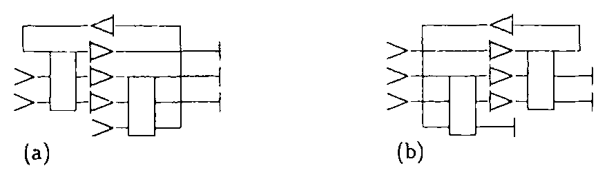

*Figure 19. (a) A conservative-logic network and (b) its inverse.*

Let us consider an arbitrary Boolean function \(y=f(x)\) realized by a combinational conservative-logic network \(\phi\) (Figure 20a). For the intended computation, we shall have distinguished a number of input lines of \(\phi\) as source lines, to be fed with specified constants collectively denoted by \(c\), while the remaining input lines constitute the computation’s argument, \(x\). Similarly, we shall have distinguished a number of output lines as sink lines, generating garbage values collectively denoted by \(g\), while the remaining output lines constitute the computation’s result, \(y\).

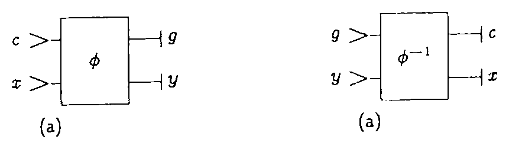

*Figure 20. (a) Computation of \(y=f(x)\) by means of a combinational conservative-logic network \(\phi\). (b) This computation is “undone” by the inverse network, \(\phi^{-1}\).*

Consider now the network \(\phi^{-1}\), which is the inverse of \(\phi\) (Figure 20b). If \(g\) and \(y\) are used as inputs for \(\phi^{-1}\), this network will “undo” \(\phi\)’s computation and return \(c\) and \(x\) as outputs. By combining the two networks, as in Figure 21, we obtain a new network which obviously computes the identity function and thus looks, in terms of input-output behavior, just like a bundle of parallel wires. Not only the argument \(x\) but also the constants \(c\) are returned unchanged. Yet, buried in the middle of this network there appears the desired result \(y\). Our next task will be to “observe” this value without disturbing the system.

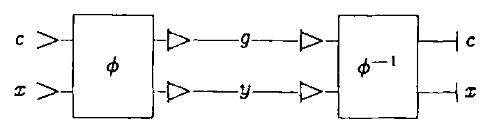

*Figure 21. The network obtained by combining \(\phi\) and \(\phi^{-1}\) looks from the outside like a bundle of parallel wires. The value \(y=f(x)\) is buried in the middle.*

In a conservative-logic circuit, consider an arbitrary internal line carrying the value \(a\) (Figure 22a). The “spy” device of Figure 22b, when fed with a 0 and a 1, allows one to extract from the circuit a copy of \(a\), together with its complement, \(\bar a\), without interfering in any way with the ongoing computation. By applying this device to every individual line of the result \(y\) of Figure 21, we obtain the complete circuit shown in Figure 23. As before, the result \(y\) produced by \(\phi\) is passed on to \(\phi^{-1}\); however, a copy of \(y\) (as well as its complement \(\bar y\)) is now available externally. The “price” for each of these copies is merely the supply of \(n\) new constants (where \(n\) is the width of the result).

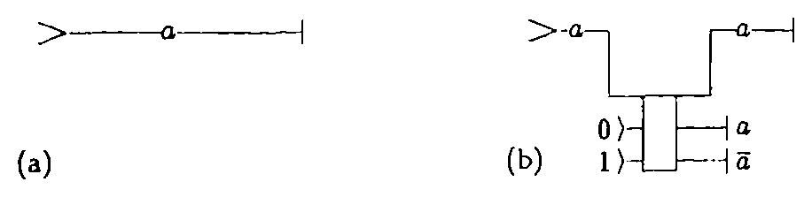

*Figure 22. The value \(a\) carried by an arbitrary line (a) can be inspected in a nondestructive way by the “spy” device in (b).*

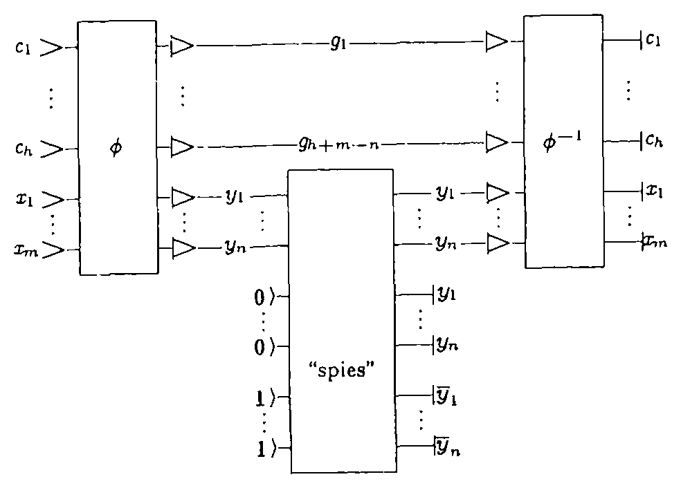

*Figure 23. A “garbageless” circuit for computing the function \(y=f(x)\). Inputs \(c_1,\ldots,c_h\) and \(x_1,\ldots,x_m\) are returned unchanged, while the constants \(0,\ldots,0\) and \(1,\ldots,1\) in the lower part of the circuit are replaced by the result \(y_1,\ldots,y_n\) and its complement \(\bar y_1,\ldots,\bar y_n\).*

The remarkable achievements of this construction are discussed below with the help of the schematic representation of Figure 24. In this figure, it will be convenient to visualize the input registers as "magnetic bulletin boards," in which identical, undestroyable magnetic tokens can be moved on the board surface. A token at a given position on the board represents a 1, while the absence of a token at that position represents a 0. The capacity of a board is the maximum number of tokens that can be placed on it. Three such registers are sent through a "black box" F, which represents the conservative-logic circuit of Figure 23, and when they reappear some of the tokens may have been moved, but none taken away or added. Let us follow this process, register by register.

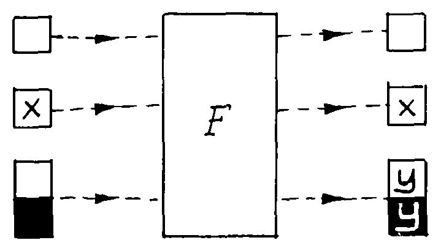

*Figure 24. The conservative-logic scheme for garbageless computation. Three data registers are “shot” through a conservative-logic black box \(F\). The register with the argument, \(x\), is returned unchanged; the clean register on top of the figure, representing an appropriate supply of input constants, is used as a scratchpad during the computation (cf. the \(c\) and \(g\) lines in Figure 23) but is returned clean at the end of the computation. Finally, the tokens on the register at the bottom of the figure are rearranged so as to encode the result \(y\) and its complement \(\bar y\).*

**(a)** The “argument” register, containing a given arrangement of tokens \(x\), is returned unchanged. The capacity of this register is \(m\), i.e., the number of bits in \(x\).

**(b)** A clean “scratchpad register” with a capacity of \(h\) tokens is supplied, and will be returned clean. (This is the main supply of constants—namely, \(c_1,\ldots,c_h\) in Figure 23.) Note that a clean register means one with all 0’s (i.e., no tokens), while we used both 0’s and 1’s as constants, as needed, in the construction of Figure 10. However, a proof due to N. Margolus shows that all 0’s can be used in this register without loss of generality. In other words, the essential function of this register is to provide the computation with spare room rather than tokens.

**(c)** Finally, we supply a clean “result” register of capacity \(2n\) (where \(n\) is the number of bits in \(y\)). For this register, clean means that the top half is empty and the bottom half completely filled with tokens. The overall effect of the computation \(F\) is to rearrange these tokens on the board so as to construct a “positive” and a “negative” image of the result, i.e., \(y\) and \(\bar y\).

One must preload the result register with an appropriate number of tokens because the circuit is conservative, and thus cannot turn 0’s into 1’s or vice versa. If one waives the conservation constraint and only insists on reversibility, then with suitable primitives one can achieve a slightly simpler scheme (Toffoli, 1980) than that of Figure 24. Briefly, one would provide a clear (all 0’s) result register of size \(n\) (rather than \(2n\)), and at the end of the computation this register would contain just \(y\) (rather than \(y\) and \(\bar y\).

With reference to Figure 24, it must be stressed that the only change in the state of the system introduced by the computation \(F\) is to turn a set of constants into the desired result \(y\). In other words, *to carry out a computation there is no need to increase the entropy of the computer’s environment.*

One might object that, having obtained the result \(y\), the computer’s user may have lost interest in the argument \(x\) and may want to “throw it away.” Our construction makes it clear that the responsibility for thus thermalizing \(x\) rests on the user, rather than on the mechanics of the computation. Nevertheless, let us consider a *bona fide* user who is accustomed to traditional computation (where \(x\) is routinely thrown away) and wants to try our “garbageless” computer without having to learn new bookkeeping habits. He might argue, “The bits that are returned in the argument register are nominally garbage, since they still depend (though, I admit, in a very simple way) on the argument, and I will not reuse them as constants for a new computation. Thus, I supplied an \(m\)-bit-wide argument plus \(n\) bits of constants (or \(2n\) bits, in the conservative case), and I got back an \(n\)-bit-wide result plus \(m\) bits of data that I don’t need. As far as I’m concerned, the computation has had the side effect of turning \(n\) bits of ‘useful energy’ into \(m\) bits of ‘heat.’” Even if one accepts this viewpoint (but cf. below), the relevance of our construction is hardly affected. In fact, it is clear that the extent of this minor, user-induced “dissipation” involving at worst \(m\) bits has nothing to do with the number of gates involved in the computation. This number, which in Figure 23 is proportional to \(h\)—the size of the scratchpad register—in general grows exponentially with \(m\). In physical terms, while a “\(kT\)” barrier (cf. Section 1) of the form \(2^m kT\) would pose a major threat to high-performance computation, a barrier of the form \(mkT\) is just a minor nuisance.

### 7.2. Role of the Scratchpad Register. Trade-Offs Between Space, Time, and Available Primitives

In the construction of Figures 23 and 24, the function \(F\) which connects the initial value of the argument/result register pair to its final value is both invertible and conservative, quite independently of the values of the constants \(c_1,\ldots,c_h\) in the scratchpad register. We have also noted that no loss of generality is incurred if these constants are set equal to 0. Why, then, is it not possible to eliminate the scratchpad register altogether? In other words, is there not for any function \(f\) a conservative-logic circuit \(F_0\) of the following form (Figure 25), where \(y=f(x)\)?

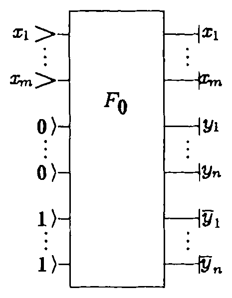

*Figure 25. A conservative-logic “circuit” which computes \(y=f(x)\) without using a scratchpad register.*

The answer is, of course, yes, since \(F_0\) is invertible and conservative, and thus by definition a conservative-logic gate. However, this “construction” is quite uninteresting since in general \(F_0\) cannot be realized by composition of smaller conservative-logic primitives (Toffoli, 1980). Therefore, a scratchpad register is essential if one wants to compute an *arbitrary* function \(f\) starting from a *fixed* set of conservative-logic primitives. Intuitively, the reversibility constraint makes a computing gearbox so tight that certain functions cannot be computed at all unless some “play” is provided—in the form of additional degrees of freedom—by the scratchpad register.

The next question is, given a fixed set of primitives, how much “play” do we need in order to compute \(f\)? In other words, how does the size \(h\) of the scratchpad register depend on the size of the computational problem? As one might expect, also in this context there are definite trade-offs between “space” (i.e., the size of the scratchpad register) and “time” (i.e., the delay between input and output), as discussed, for instance, by Bennett (1973). At one extreme of the range (viz., least time), the construction of Section 4 implies that a scratchpad register of size proportional to \(\exp m\) (where \(m\) is the size of the argument) is certainly enough. At the other extreme (least size), using only the Fredkin gate as a primitive the least usable size for this register is proportional to \(m\).

### 7.3. Circuits That Convert Argument into Result. General-Purpose Conservative-Logic Computers

In the construction of Figures 23 and 24, for the sake of conceptual clarity we have made use of separate argument and result registers. The argument register is returned unchanged, while the constants placed in the result register are rearranged into the desired result (cf. Figure 26a, in which the scratchpad register has been omitted for clarity).

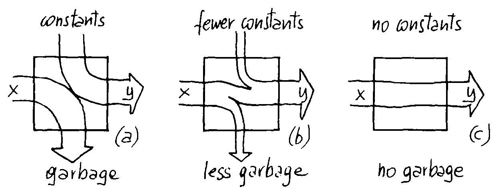

*Figure 26. While in general (a) one cannot depend on the argument tokens in order to synthesize the result, in a typical case (b) some of the tokens can be reused. If the desired function is both invertible and conservative (c), then the result can be obtained by just rearranging the argument tokens. (The scratchpad register has been omitted for clarity.)*

Is it possible to design a circuit which would directly rearrange the tokens of the argument \(x\) into the result \(y=f(x)\), using one and the same register for \(x\) and \(y\)? Such a computational scheme (Figure 26c) would be particularly convenient in iterative computation, where the result of one iteration directly constitutes the argument for the next.

In many cases, it is possible to achieve some economy in terms of source and sink lines, as shown in Figure 26b, depending on the nature of the function \(f\). However, for the extreme situation of Figure 26c to be realizable by a conservative-logic circuit, a necessary condition is that \(f\) be both invertible and conservative (this is trivial). This condition is also sufficient (trivially) if one allows arbitrary conservative-logic primitives. What is important is that the condition remains sufficient (as proved by B. Silver) even for circuits that use the Fredkin gate as the only primitive. That is, *any invertible, conservative function, and thus any iterate of such a function, can be realized without garbage by means of the Fredkin gate.*

Even when used in an interactive or process-control mode, an ordinary general-purpose computer owes its power and flexibility to its ability to operate in a "closed" mode for sustained periods of time; that is, arbitrary input-output relationships (within given time and memory limits) can be synthesized by letting a fixed "CPU function" operate in an iterative way on an internal set of variables (program plus data).

By sending the output back to the input in Figure 26c, and similarly recycling the constants in the scratchpad register, one obtains a closed conservative-logic computer. With some ingenuity, it is possible to design in this fashion general-purpose conservative-logic computers (Ressler, 1981) based on the Fredkin gate, having a circuit complexity comparable, in terms of number of gates, with that of ordinary computers based on the NAND gate.

## 8. Energy Involved in a Computation

With regard to energy, we have debated so far to what extent it must be *dissipated* in a computation. Having reached the conclusion that in ideal conditions no energy need be dissipated, one may wonder how much energy need be *involved* in a computation.

The topic of how much energy signals must have has received much attention in the past (Shannon, 1948; Bekenstein, 1981b), but mostly in the context of information *transmission* rather than of information *processing*. Actually, because of thermal noise and quantization problems, issues of signal energy may arise at the moment of launching a signal or at the moment of receiving it, but as long as the medium is not noisy or dispersive the energy of a signal during its free travel seems to be irrelevant. The situation changes if this free travel is replaced by an “obstacle course,” i.e., some form of processing, where signals are forced by a computer to nonlinearly interact with one another. In this case, what energy a signal must have may be dictated by the nature of the anticipated interactions or by other considerations.[^9]

At any rate, the billiard ball model (in which the energy is simply proportional to the number of balls) shows that the energy involved in a computation need not be greater than just that in which the argument and the result signals themselves are encoded. Thus, there is no necessary connection between the energy involved in a computation and its length or complexity.

## 9. Other Physical Models of Reversible Computation

A kinematical (rather than dynamical) model of reversible computation, compatible with the rules of classical analytical mechanics, was described by Toffoli (1981). In this model, binary values are encoded as distinguished phase angles of rotating shafts, and nonlinear—though reversible—coupling between shafts is achieved by suitable "cam followers." Such a mechanism offers a simple, intuitive realization of the AND/NAND gate (Toffoli, 1980), a universal, reversible, nonconservative primitive.

An approach to microscopic computation which is less defensive toward thermal noise than the one considered here is discussed by Bennett (1979). There, the isolation between mechanical modes and thermal modes is achieved only on a time average, and computation may be made dissipationless in the limit \(t\to\infty\), where \(t\) is the input-to-output delay.

Analogous dissipation properties are exhibited by a stylized though substantially realistic electronic implementation of conservative logic (Fredkin and Toffoli, 1978). This is an active \(RLC\) circuit in which switching is performed by MOS transistors. Resistors and capacitors are “parasitic” elements of the transistors themselves, while inductors are discrete components. As \(L/(CR^2)\) increases the computation slows down, but the energy dissipated by each elementary computational step approaches zero as closely as desired.

Finally, Benioff has discussed a stylized realization of universal, reversible Turing machines based on quantum-mechanical principles (Benioff, 1980). This approach is especially relevant to some still unresolved issues discussed in Section 5—in particular, Question 4.

## 10. Conclusions

We have shown that abstract systems having universal computing capabilities can be constructed from simple primitives which are invertible and conservative. By exhibiting and discussing a detailed classical-mechanical model of such systems, we have given constructive evidence that it may be possible to design actual computing mechanisms that are better attuned with the resources offered by nature. Virtually nondissipative computing mechanisms are compatible with general physical principles.

In conclusion, conservative logic constitutes a productive and readily accessible context in which many problems at the crossroads of mathematics, physics, and computer science can be recognized and addressed.

## Acknowledgments

For our work on reversible computing in general, see the historical and bibliographical credits in "Reversible Computing" (Toffoli, 1980); also cf. the germinal ideas of Petri’s (1967). For conservative logic, we acknowledge contributions by E. Barton and D. Silver; and for the billiard ball model contributions by R. Feynman, N. Margolus, and A. Ressler. Many fruitful discussions with C. Bennett, G. Chaitin, R. Feynman, and R. Landauer provided insight and encouragement. A careful reading by N. Margolus resulted in a number of substantial clarifications.

## References

- Baierlein, R. (1971). *Atoms and Information Theory*. W. H. Freeman, San Francisco.
- Bekenstein, J. D. (1981a). “Universal upper bound to entropy-to-energy ratio for bounded systems,” *Physical Review D*, **23**, 287–298.
- Bekenstein, J. D. (1981b). “Energy cost of information transfer,” *Physical Review Letters*, **46**, 623–626.
- Benioff, P. (1980). “The computer as a physical system: a microscopic quantum mechanical Hamiltonian model of computers as represented by Turing machines,” *Journal of Statistical Physics*, **22**, 563–591.
- Bennett, C. H. (1973). “Logical reversibility of computation,” *IBM Journal of Research and Development*, **6**, 525–532.
- Bennett, C. H. (1979). “Dissipation-error tradeoff in proofreading.” *BioSystems*, **11**, 85–91.
- Feynman, R. (1963). *Lectures on Physics*, Vol. I. Addison-Wesley, Reading, Massachusetts.
- Fredkin, E., and Toffoli, T. (1978). “Design principles for achieving high-performance submicron digital technologies,” Proposal to DARPA, MIT Laboratory for Computer Science.
- Haken, H. (1975). “Cooperative phenomena,” *Reviews of Modern Physics*, **47**, 95.
- Herrell, D. J. (1974). “Femtojoule Josephson tunnelling logic gates,” *IEEE Journal of Solid State Circuits*, **SC-9**, 277–282.
- Katz, A. (1967). *Principles of Statistical Mechanics—The Information Theory Approach*. Freeman, San Francisco.
- Keyes, R. W. (1977). “Physical uncertainty and information,” *IEEE Transactions on Computers*, **C-26**, 1017–1025.
- Kinoshita, K., Tsutomu, S., Jun, M. (1976). “On magnetic bubble circuits,” *IEEE Transactions on Computers*, **C-25**, 247–253.
- Landau, L. D., and Lifshitz, E. M. (1960). *Mechanics*. Pergamon Press, New York.
- Landauer, R. (1961). “Irreversibility and heat generation in the computing process,” *IBM Journal of Research and Development*, **5**, 183–191.
- Landauer, R. (1967). “Wanted: a physically possible theory of physics,” *IEEE Spectrum*, **4**, 105–109.
- Landauer, R. (1976). “Fundamental limitations in the computational process,” *Berichte der Bunsengesellschaft fuer Physikalische Chemie*, **80**, 1041–1256.
- Ohanian, H. C. (1976). *Gravitation and Spacetime*. Norton, New York.
- Petri, C. A. (1967). “Grundsätzliches zur Beschreibung diskreter Prozesse,” 3rd Colloquium über Automatentheorie, Basel, Birkhäuser Verlag. (An English translation is available from Petri or from the authors.)
- Priese, L. (1976). “On a simple combinatorial structure sufficient for sublying nontrivial self-reproduction,” *Journal of Cybernetics*, **6**, 101–137.
- Ressler, A. *The design of a conservative logic computer and a graphical editor simulator*, M.S. Thesis, MIT, EECS Department (January 1981).
- Shannon, Claude E. “A mathematical theory of communication,” *Bell Systems Technical Journal*, **27**, 379–423 and 623–656.
- Toffoli, T. (1977). “Computation and construction universality of reversible cellular automata,” *Journal of Computer Systems Science*, **15**, 213–231.
- Toffoli, T. (1977). “Cellular automata mechanics,” *Technical Report* No. 208, Logic of Computers Group, CCS Department, The University of Michigan, Ann Arbor, Michigan (November).
- Toffoli, T. (1980). “Reversible computing,” *Technical Memo MIT/LCS/TM-151*, MIT Laboratory for Computer Science (February). An abridged version of this paper appeared under the same title in *Seventh Colloquium on Automata, Languages and Programming*, J. W. de Bakker and J. van Leeuwen, eds. Springer, Berlin (1980), pp. 632–644. An enlarged, revised version for final publication is in preparation.
- Toffoli, T. (1981). “Bicontinuous extensions of invertible combinatorial functions,” *Mathematical Systems Theory*, **14**, 13–23.
- Turing, A. M. (1936). “On computable numbers, with an application to the entscheidungs problem,” *Proceedings of the London Mathematical Society*, Ser. 2, **43**, 544–546.

[^1]: This research was supported by the Defense Advanced Research Projects Agency and was monitored by the Office of Naval Research under Contract No. N00014-75-C-0661.

[^2]: The “loss of information” associated with an irreversible process is usually expressed in terms of a quantity called (information-theoretic) entropy. Briefly, let \(p_i\) be the probability of state \(i\) in a given state distribution. Then the information-theoretic entropy of this distribution is \(-\sum_i p_i\log p_i\). If the logarithm is taken in base 2, then the entropy is said to be measured in bits. For example, assuming equal probabilities for all possible values of the argument, the evaluation of the NAND function entails a decrease in entropy of approximately 1.189 bits, while the complete erasure of one binary argument (such as given by the function \(\{0\mapsto0,1\mapsto0\}\)) entails a decrease of exactly 1 bit. Note that information-theoretic entropy is in general a much more richly endowed function than thermodynamic entropy (Baierlein, 1971); in the present situation, however, the two quantities can be identified—the conversion factor being given by the relation \(1\text{ bit}=k\ln2\).

[^3]: It should be noted that reversibility does not imply invariance under time reversal; the latter is a more specialized notion. Intuitively, a reversible system is one that is retrodictable or “backward deterministic.”

[^4]: The composition rules of conservative logic force one to explicitly consider the distributed delays encountered in routing a signal from one processing element to the next. In conventional sequential networks propagation delays are not explicitly associated with individual gates or wires; rather, they are implicitly lumped in the so-called “delay elements.” Yet, in these networks the delay elements already have an explicit formal role, related to proper causal ordering rather than to timing *per se* (Toffoli, 1980). This confusion about the role of delay elements is avoided in conservative logic.

[^5]: An approach which is intermediate between conservative and damped mechanisms is briefly discussed in Section 9.

[^6]: And, of course, to the extent to which elastic collisions represent an acceptable stylization of physical effects.

[^7]: Note that the interaction gate has four output lines but only four (rather than \(2^4\)) output states—in other words, the output variables are constrained. When one considers its inverse (Figure 13b), the same constraints appear on the input variables. In composing functions of this kind, one must exercise due care that the constraints are satisfied.

[^8]: Rather than of its laws, which are fixed and by definition known to us.

[^9]: Note that on dimensional grounds it would be pointless to look for a strict “energetic equivalent” of information. An “amount of information” is arrived at by counting in a certain way the states of a system, and is thus associated with a certain classification of states (while energy is a property of individual states). The natural unit for performing this count, i.e., for spanning portions of the state space, is the quantum of action—not an energy yardstick. Additional parameters must be specified in order to arrive at energy values.
